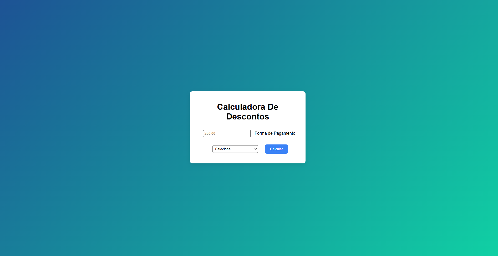

# Calculadora de Descontos
Este projeto é sobre uma calculadora de descontos de produtos

## Tela do site

## 📄Funcionalidades
* Botão para a forma de pagamento
* Campo para informar o preço que vai pagar
* E resultado do preço

## 🤖Tecnologias ultilizadas
* HTML
* CSS
* JavaScript
* Git e GitHub
* VS Code

## 👨🏽‍💻Como rodar
* 1. Baixe o repositório (Clique no Botão “Code” > Download ZIP)
* 2. Extraia a pasta
* 3. Abra o arquivo index.html no navegador
 
## 👾Como Clonar
* No terminal do VS Code digite:
* git clone https://github.com/nunes-1811/calculadoradedescontos.git
* *No menu: File(Arquivo) > Clone a repositor(Clonar repositório) > Selecione a aba URL, no campo URL, cole o link do repositório https://github.com/nunes-1811/calculadoradedescontos.git

